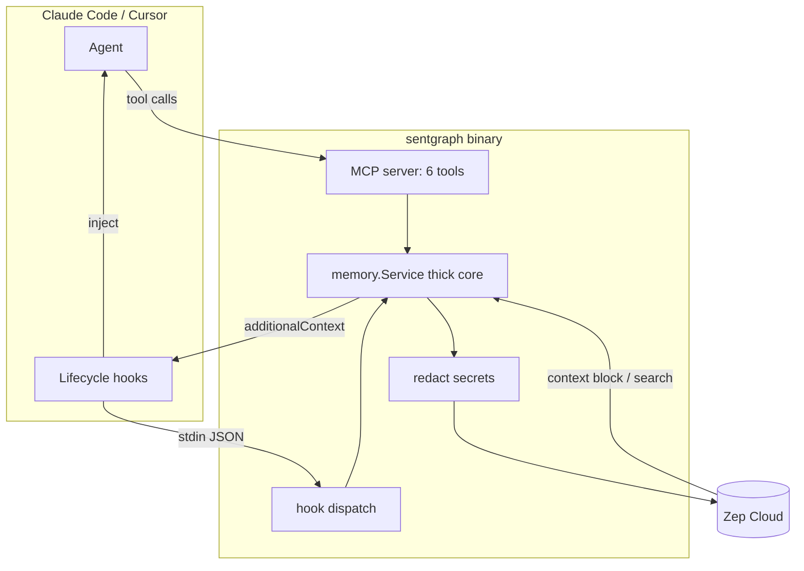

# Sentgraph MCP -- план реализации

Memory-MCP-сервер на Go поверх Zep Cloud: один бинарник, 6 основных MCP-инструментов, нативные хуки жизненного цикла и скиллы. Тяжёлую работу (граф, эмбеддинги, поиск, дедупликацию) делает Zep; локально остаются только конфиг, безопасная редакция секретов, маршрутизация хуков и тонкий MCP/API слой.

---

## 0. Решения (зафиксировано)

- Язык: **Go 1.25+**. Один бинарник `sentgraph` с режимами `serve` / `hook <event>` / `doctor`.
- Zep SDK: **`github.com/getzep/zep-go/v3`** (v3.23.0).
- MCP SDK: **`github.com/modelcontextprotocol/go-sdk`** (v1.6.1, GA; stdio + Streamable HTTP, типизированные инструменты, аннотации).
- Скоупинг: один Zep `user` = разработчик (личный граф, кросс-проектное) **+ один standalone graph на ПРОЕКТ** (проект может включать ~10 репозиториев).
- Хуки зовут Zep **напрямую**, без демона. Общий internal-пакет с MCP-сервером. Старт ~мс.
- Частоты: **читать больше, писать больше** (см. раздел 6).

---

## 1. `zep-memory.md`

`zep-memory.md` синхронизирован с этим планом и кодом. Ключевые решения там же:
- Zep строит граф и context block; локально -- только redact и лимиты.
- Хуки инжектят контекст через `hookSpecificOutput.additionalContext` (`SessionStart`, `UserPromptSubmit`, `PreCompact`).
- `GetUserContext` без параметра `mode`; `AddMessages` с `ReturnContext` для write+read одним вызовом.
- Реализация на Go, не Python-референс.

---

## 2. Архитектура



---

## 3. Маппинг на модель Zep

- `user` = разработчик: env `ZEP_USER_ID`. Личный граф (предпочтения, стиль, кросс-проектное).
- `graph` (standalone) = проект: `graph_id = "proj:<project_id>"`, создаётся идемпотентно. Один на проект, общий для всех его репозиториев.
- `project_id` задаётся обязательной env `SENTGRAPH_PROJECT_ID` (из окружения или `.env.local`). Несколько репо с одним `project_id` => общий граф проекта.
- `thread_id` = Claude `session_id` (из stdin хука). Threads принадлежат `user` и вливаются в его граф.
- Запись: диалоговые реплики -> `Thread.AddMessages` (личный граф); проектные факты -> `Graph.Add(graph_id=proj:...)`.
- Чтение: `Thread.GetUserContext` (личный контекст) + `Graph.Search(graph_id=proj:...)` (проектные факты) -> склейка с токен-бюджетом.

---

## 4. MCP-инструменты -- основные методы (6). Лишнее убрано

Из 13 инструментов Python-референса админский CRUD (`manage_user/thread/graph/...`, `project_info`, `get_task`) наружу НЕ выносим. `ensure user+thread+graph` -- внутренняя идемпотентная операция, не инструмент.

Каждый инструмент: имя -> аннотация -> Zep-метод (Go v3) -> кто использует.

1. `memory_context` (readOnly) -> `client.Thread.GetUserContext(ctx, threadID, *zep.ThreadGetUserContextRequest) (*zep.ThreadContextResponse, error)` (+ опц. `Graph.Search` по проекту). Контекст-блок о пользователе и проекте. -> хуки чтения, `/recall`, reference-скилл.
2. `memory_search` (readOnly) -> `client.Graph.Search(ctx, *zep.GraphSearchQuery) (*zep.GraphSearchResults, error)` (Scope edges/nodes/episodes, target user|project, Limit). Точечный поиск факта. -> `/recall`, reference-скилл.
3. `memory_history` (readOnly) -> `client.Thread.Get(ctx, threadID, *zep.ThreadGetRequest) (*zep.MessageListResponse, error)`. Показать записанное в треде (история за пользователем). -> `/session-history`.
4. `memory_add_messages` (write, non-destructive) -> `client.Thread.AddMessages(ctx, threadID, *zep.AddThreadMessagesRequest) (*zep.AddThreadMessagesResponse, error)` с `ReturnContext`. Записать реплики диалога (<=30/вызов, <=4096 симв). -> хуки записи, `/remember`.
5. `memory_add` (write, non-destructive) -> `client.Graph.Add(ctx, *zep.AddDataRequest) (*zep.Episode, error)` (Type text/json, target user|project, чанк >10k). Сохранить факт/решение/бизнес-данные. -> `/remember`, reference-скилл.
6. `memory_forget` (destructive) -> `client.Graph.Edge.Delete(ctx, uuid_)` / `client.Graph.Node.Delete(ctx, uuid)` / `client.Graph.Episode.Delete(ctx, uuid_)`. Удалить запись. -> `/forget`.

Каждый из 6 методов либо используется в навыке, либо подробно описан в reference-скилле `sentgraph-tools`.

Регистрация в MCP SDK (официальный):
```go
mcp.AddTool(s, &mcp.Tool{
    Name:        "memory_context",
    Title:       "Get memory context",
    Description: "Assembled context block about the user and current project.",
    Annotations: &mcp.ToolAnnotations{ReadOnlyHint: true},
}, memoryContext) // func(ctx, *mcp.CallToolRequest, In) (*mcp.CallToolResult, Out, error)
```

---

## 5. Внутренний слой (толстое ядро `internal/memory`)

Зависимости инжектируются аргументами (Zep-клиент, конфиг) -- не конструируются внутри бизнес-логики.

- `EnsureIdentity(ctx) (Identity, error)` -- идемпотентно создаёт Zep `user` + проектный `graph` + резолвит `thread` для сессии. Внутри: `User.Add` (игнор "уже существует"), `Graph.Create`, `Thread.Create`.
- `GetContext(ctx, opts) (string, error)` -- `Thread.GetUserContext` + опц. `Graph.Search(project)`, склейка + токен-бюджет.
- `AddTurn(ctx, msgs []Message, returnContext bool) (ctxBlock string, err error)` -- redact -> `Thread.AddMessages` (+ опц. `Graph.Add` в проект).
- `Search(ctx, query, scope, target, limit) (Results, error)` -> `Graph.Search`.
- `AddData(ctx, data, dtype, target) error` -- redact -> чанк >10k -> `Graph.Add`.
- `History(ctx, limit) (Messages, error)` -> `Thread.Get`.
- `Forget(ctx, uuid, kind) error` -> `Graph.{Edge|Node|Episode}.Delete`.
- Статус ингеста (опц.): `Graph.Episode.Get(ctx, uuid).Processed`.

Инициализация Zep:
```go
client := zepclient.NewClient(option.WithAPIKey(os.Getenv("ZEP_API_KEY")))
```

---

## 6. Хуки -- "читать больше, писать больше"

Дефолтный набор (улучшение над доком: там запись только на Stop, чтение только в начале):
- `SessionStart` (READ): `EnsureIdentity` + `GetContext` -> inject `additionalContext`.
- `UserPromptSubmit` (READ+WRITE): записать реплику пользователя + свежий контекст -> inject. Ядро "забирать/отправлять чаще" -- на каждом промпте.
- `Stop` (WRITE): распарсить хвост транскрипта -> записать ответ ассистента (+ опц. проектный факт).
- `PreCompact` (READ): `GetContext` -> inject, чтобы память пережила компакцию.
- `SessionEnd` (WRITE): финальный флаш.
- `PostToolUse` (WRITE, ОПЦИОНАЛЬНО, default OFF): значимые tool-выводы -> `Graph.Add(project)`.

Тумблеры: `SENTGRAPH_INJECT_EVERY_PROMPT` (default on), `SENTGRAPH_PROJECT_AUTOCAPTURE` (default on), `SENTGRAPH_CONTEXT_TOKEN_BUDGET`, `SENTGRAPH_CAPTURE_TOOLS` (default off).

Формат инъекции (stdout хука):
```json
{"hookSpecificOutput": {"hookEventName": "UserPromptSubmit", "additionalContext": "<zep context block>"}}
```

`plugin/hooks/hooks.json` -> каждый event вызывает `sentgraph-mcp hook <event>` (читает stdin JSON, диспатчит).

---

## 7. Скиллы (формат SKILL.md)

Действия (история остаётся за пользователем):
- `recall` -- вспомнить контекст/факты (`memory_context` + `memory_search`).
- `remember` -- сохранить факт/решение (`memory_add` / `memory_add_messages`).
- `forget` -- удалить запись (`memory_forget`).
- `session-history` -- показать записанное (`memory_history`).

Reference (грузится по требованию):
- `sentgraph-tools` -- подробная документация всех 6 инструментов.

---

## 8. Вставка для CLAUDE.md / AGENTS.md

```md
## Память (sentgraph MCP)
У тебя есть долговременная память через MCP-сервер `sentgraph` (бэкенд -- Zep Cloud).
- В начале работы и при смене темы вызывай `memory_context` и учитывай его в ответах.
- Нужен конкретный факт из прошлого -- вызывай `memory_search` с коротким точным запросом.
- Узнал устойчивый факт/предпочтение/важное решение -- сохрани через `memory_add` (или `/remember`). Не жди конца сессии.
- Историей управляет пользователь: `/session-history` -- что записано, `/forget` -- удалить.
- Рутинная запись диалога идёт автоматически через хуки -- не дублируй; сохраняй только важное надолго.
- Никогда не клади в память секреты/токены/ключи.
```

---

## 9. Структура Go-проекта

```
sentgraph-mcp/
  .claude-plugin/marketplace.json  # маркетплейс плагина для /plugin install
  go.mod                 # module github.com/shilin23061991/sentgraph-mcp, go 1.25
  main.go                # CLI (binary sentgraph-mcp): serve | hook <event> | doctor
  internal/
    config/config.go     # ZEP_API_KEY, ZEP_USER_ID, SENTGRAPH_PROJECT_ID (env + .env.local), тумблеры
    zepstore/store.go    # адаптер zep-go/v3 (memory.Gateway)
    memory/service.go    # толстое ядро (раздел 5)
    redact/redact.go     # вырезание секретов до отправки
    transcript/transcript.go  # парс хвоста транскрипта Claude (JSONL)
    mcpserver/server.go  # регистрация 6 инструментов (stdio + Streamable HTTP)
    hooks/dispatch.go    # обработчики событий
  plugin/
    .claude-plugin/plugin.json
    .mcp.json            # встроенный MCP (sentgraph-mcp serve)
    hooks/hooks.json
    skills/{recall,remember,forget,session-history,sentgraph-tools}/SKILL.md
  CLAUDE.snippet.md
  .env.example
  README.md
```

---

## 10. Зависимости / конфиг / безопасность

- `go get github.com/getzep/zep-go/v3` + `go get github.com/modelcontextprotocol/go-sdk`.
- Безопасность: редакция секретов до отправки в облако (API keys, JWT, AWS/GCP, bearer); никаких ключей в коде (только env); валидация входов инструментов.

---

## 11. Статус реализации

- [x] Скелет: `go.mod` (go 1.25) + зависимости; main-пакет в корне (бинарь `sentgraph-mcp`) с режимами `serve`/`hook`/`doctor`.
- [x] `internal/config`: обязательные ключи ZEP_API_KEY, ZEP_USER_ID, SENTGRAPH_PROJECT_ID из env, с автозагрузкой `.env.local` (godotenv, non-override) и хард-требованием `.env.local` для serve/doctor, тумблеры.
- [x] `internal/redact`: вырезание секретов (API key, JWT, AWS/GCP, bearer).
- [x] `internal/zepstore` + `internal/memory`: `EnsureIdentity`, `GetContext`, `AddTurn` (return_context), `Search`, `AddData` (чанк >10k), `History`, `Forget`.
- [x] `internal/mcpserver`: регистрация 6 инструментов с аннотациями; запуск stdio и Streamable HTTP.
- [x] `internal/transcript`: парс хвоста транскрипта Claude (JSONL) для Stop/SessionEnd.
- [x] `internal/hooks` + `plugin/hooks/hooks.json`: SessionStart, UserPromptSubmit, Stop, PreCompact, SessionEnd (+опц. PostToolUse); инъекция через additionalContext.
- [x] `plugin`: `plugin.json` + 4 action-скилла + reference-скилл `sentgraph-tools` + встроенный MCP (`plugin/.mcp.json`); ставится через marketplace (`.claude-plugin/marketplace.json`, `--scope project`).
- [x] `CLAUDE.snippet.md`, `.env.example`, README, `zep-memory.md`.
- [x] Тесты (redact/config/transcript/service с endpoint-shaped мок-Zep) + `go build ./...`, `go vet ./...`, `go test ./...`.
